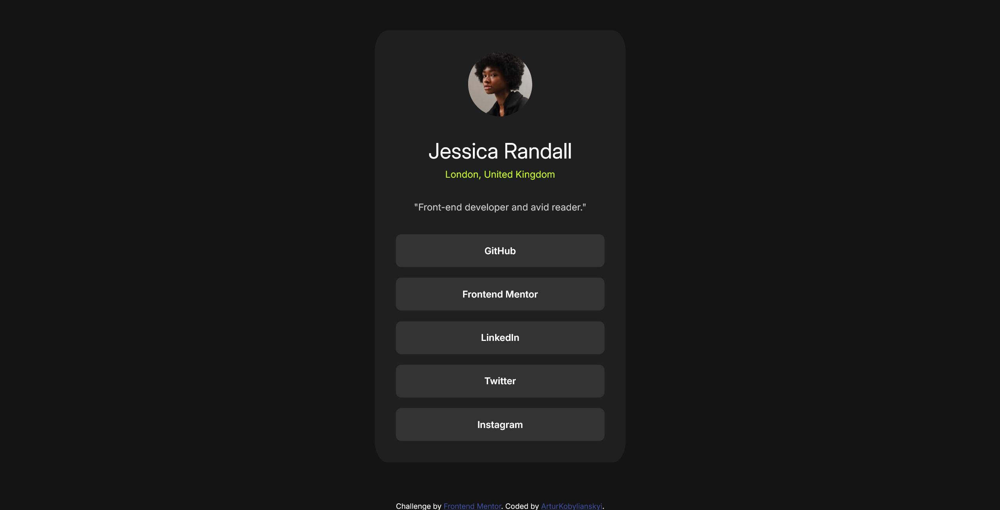

# Frontend Mentor - Social links profile solution

This is a solution to the [Social links profile challenge on Frontend Mentor](https://www.frontendmentor.io/challenges/social-links-profile-UG32l9m6dQ). Frontend Mentor challenges help you improve your coding skills by building realistic projects. 

## Table of contents

- [Overview](#overview)
  - [The challenge](#the-challenge)
  - [Screenshot](#screenshot)
  - [Links](#links)
  - [Built with](#built-with)
  - [What I learned](#what-i-learned)
  - [Useful resources](#useful-resources)

## Overview

### The challenge

Users should be able to:

- See hover and focus states for all interactive elements on the page

### Screenshot

### Links

- Live Site URL: [live site URL here](https://arturkobylianskyi.github.io/Social-links-profile/)

### Built with

- Semantic HTML5 markup
- CSS custom properties
- Flexbox
- CSS Grid
- Mobile-first workflow

### What I learned

HTML: Focused on using tags semantically (main, article, h1, blockquote) to give the content proper meaning and structure.

CSS: Switched from styling generic tags to using specific classes for the component, and learned to separate layout (ul) from appearance (a).

### Useful resources

- [MDN](https://developer.mozilla.org/en-US/docs/Web/CSS/list-style)
